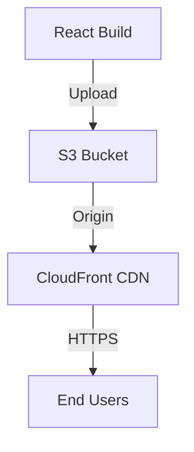
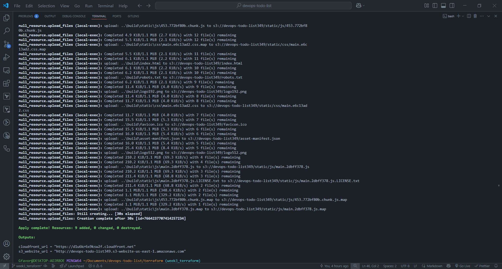
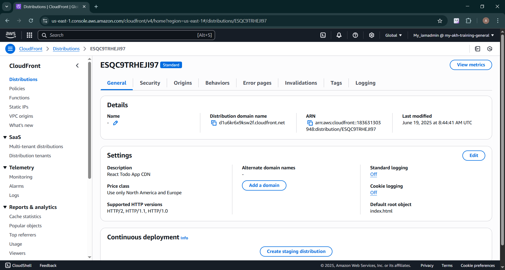

# DevOps Todo List - Infrastructure as Code with Terraform


##  Project Overview

This project automates the deployment of a React Todo List application to AWS infrastructure using Terraform. It creates a highly available, cost-effective static website architecture with:

- **S3 Bucket** for static website hosting
- **CloudFront CDN** for global content delivery and HTTPS
- Automated build uploads via Terraform

##  Week 3 Objectives

**Translate manual setup into reusable infrastructure-as-code using Terraform:**

- [x] Install and configure Terraform
- [x] Create S3 bucket for static hosting
- [x] Set up CloudFront distribution
- [ ] *(Optional)* Add Route 53 and ACM for custom domain
- [x] Automate React build uploads

## 🛠️ Prerequisites

Before you begin, ensure you have:

1. **AWS Account** with IAM credentials configured
2. **AWS CLI** installed and configured (`aws configure`)
3. **Terraform** v1.5+ installed
4. **Node.js** and npm for React app builds
5. **Git** for version control

## 🚀 Deployment Architecture



## 📂 Project Structure

```
  terraform-deployment/
├── main.tf            # Primary infrastructure configuration
├── variables.tf       # Variable declarations
├── outputs.tf         # Output values
└── README.md          # This documentation
```

## 🧑‍💻 Installation & Usage

### 1. Clone the Repository

```bash
git clone https://github.com/GfavourBraimah/terraform-todo-list-
cd devops-todo-list/terraform
```

### 2. Initialize Terraform

```bash
terraform init
```

### 3. Build React Application

```bash
cd ../react-app
npm install
npm run build
```

### 4. Deploy Infrastructure

```bash
cd ../terraform
terraform plan
terraform apply
```

### 5. Access Your Application

After deployment completes, access your app via:

- **CloudFront URL:**  
  `https://d1u6kr6x9ksw2f.cloudfront.net`

- **S3 Website URL:**  
  `http://devops-todo-list349.s3-website-us-east-1.amazonaws.com`

  ## 🌟 Key Features

- **Infrastructure as Code:** Entire AWS environment defined in Terraform
- **Automated Deployments:** Single command to provision all resources
- **Cost Optimization:** Uses CloudFront's free tier
- **High Availability:** Global CDN distribution
- **Security:** HTTPS enforced via CloudFront

---

## 📝 Deliverables

**Terraform configuration files:**
  - [main.tf](./terraform/main.tf)
  - [variables.tf](./terraform/variables.tf)
  - [outputs.tf](./terraform/outputs.tf)
- **Terraform apply output logs**


 
- **Deployed site URL:**  
  `https://d1u6kr6x9ksw2f.cloudfront.net`
  
  

- **GitHub Repository**
  

---

## 💡 Challenges & Learnings

### Challenges Faced

- **CloudFront-S3 Permissions:** Initially struggled with OAI (Origin Access Identity) configuration.
- **Cache Invalidation:** Needed to implement proper cache behaviors for React Router.
- **Dependency Management:** Learned to properly use `depends_on` for resource ordering.
- **CloudFront Deployment Wait:** Originally, `wait_for_deployment` was set to `false`, causing issues with incomplete CloudFront deployments. Changing `wait_for_deployment = true` ensured Terraform waits for CloudFront to fully deploy the application, removing the need for a custom timeout block.

### Key Learnings

- Terraform's declarative approach to infrastructure
- AWS best practices for static website hosting
- Importance of infrastructure documentation
- How CDN caching affects web applications

---